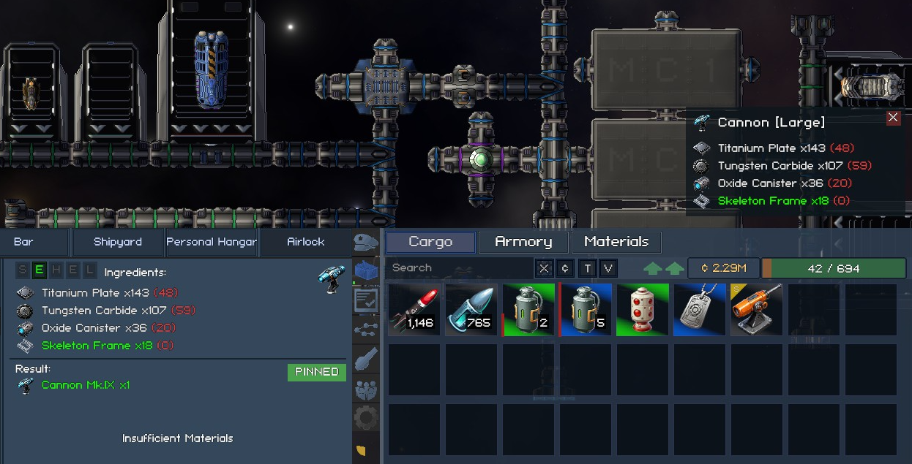

# Vanguard Galaxy Blueprint Pin (VGBlueprintPin)



A BepInEx plugin for [Vanguard Galaxy](https://store.steampowered.com/app/3471800/) that adds a pinned-blueprint HUD widget. Pin a recipe in the Forge and it stays visible on the right-mid of the screen — above the cargo indicator — so you can see what materials and sub-components you still need without reopening the Forge.

- **Pin from the Forge** — a small pin toggle on the selected-recipe panel sets the active pin.
- **Persistent HUD widget** — mirrors the Forge's selected-recipe layout: result header, refined-material rows, sub-item rows.
- **Click-to-jump** — clicking a sub-ingredient opens the Forge with that sub-recipe preselected (when at a station).
- **Tracks the side menu** — visible whenever the cargo indicator is, hidden during cutscenes / map / Forge.
- **Session-only** — the pin lives until you quit the game; no save data is touched.

The plugin is purely additive UI — no game logic, no save data, no balance changes. Disabling the plugin (or removing the DLL) restores vanilla behaviour exactly.

## Install

1. **Install BepInEx 5.x** — grab `BepInEx_win_x64_5.4.x.zip` from the [BepInEx releases](https://github.com/BepInEx/BepInEx/releases) and unzip it into your Vanguard Galaxy install folder (next to `VanguardGalaxy.exe`).
2. **Launch the game once** so BepInEx creates its `BepInEx/plugins/` and `BepInEx/config/` subfolders, then close the game.
3. **Download the VGBlueprintPin release** zip from [Releases](https://github.com/fank/vanguard-galaxy-blueprint-pin/releases).
4. **Unzip** into `BepInEx/plugins/`. The zip contains a single `VGBlueprintPin/` folder that drops in cleanly:
   ```
   VanguardGalaxy/BepInEx/plugins/
     VGBlueprintPin/
       VGBlueprintPin.dll
       README.md
   ```
5. **Launch the game.** Open the BepInEx console — you should see a load line ending with the number of Harmony patches applied, e.g.:
   ```
   [Info :Vanguard Galaxy Blueprint Pin] Vanguard Galaxy Blueprint Pin v0.1.0 loaded (N patches)
   ```

## Uninstall

Delete the `BepInEx/plugins/VGBlueprintPin/` folder. The plugin holds no config and no per-save state, so nothing else needs cleanup.

## Build

The repo commits **publicized stubs** of the three game-specific assemblies it references — `Assembly-CSharp.dll`, `UnityEngine.UI.dll`, `Unity.TextMeshPro.dll` — at `VGBlueprintPin/lib/`. These are method-signature-only stubs (every IL body replaced with `throw null;` by `assembly-publicizer --strip`), legal to redistribute, and enough to compile against. The real runtime takes over in-game.

The remaining references — BepInEx, HarmonyX, and the Unity engine modules — come from NuGet (see `VGBlueprintPin/VGBlueprintPin.csproj`).

```bash
# Build the DLL
make build      # or: dotnet build VGBlueprintPin/VGBlueprintPin.csproj -c Debug

# Build + copy into the game's BepInEx/plugins/ folder (WSL/Steam path; edit Makefile if yours differs)
make deploy
```

To regenerate the stubs after a game update, install [`assembly-publicizer`](https://github.com/CabbageCrow/AssemblyPublicizer) and run:

```bash
assembly-publicizer --strip <game>/VanguardGalaxy_Data/Managed/Assembly-CSharp.dll  -o VGBlueprintPin/lib/Assembly-CSharp.dll
assembly-publicizer --strip <game>/VanguardGalaxy_Data/Managed/UnityEngine.UI.dll   -o VGBlueprintPin/lib/UnityEngine.UI.dll
assembly-publicizer --strip <game>/VanguardGalaxy_Data/Managed/Unity.TextMeshPro.dll -o VGBlueprintPin/lib/Unity.TextMeshPro.dll
```

`--strip` is required — without it, the committed DLLs would carry the proprietary IL bodies, which can't be redistributed.

## License

MIT — see [LICENSE](LICENSE).
